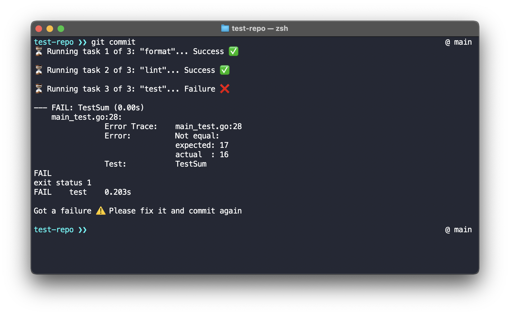
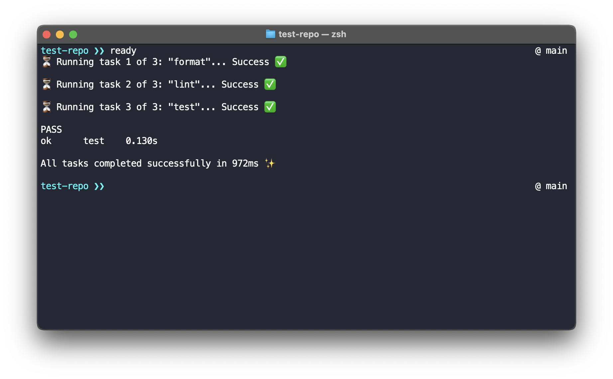

# Ready

Ready is a program to run tasks before a commit using a [pre-commit git hook](https://git-scm.com/book/en/v2/Customizing-Git-Git-Hooks).

For example, you can automatically run formatting, linting, and testing when running `git commit`, so you are assured every commit is up to the standards, issues are spotted early, and to avoid any CI pipeline failures down the road.

Tasks are run on the repository folder that contains files with changes, including the root. Monorepos are supported by using the `directory` option on the configuration file, where tasks will be run only on subfolders with changes.

At any time, tasks can be run without committing by running `ready`. By default, if there are no changed files, no tasks will be run, but you can use `ready -all` to run all tasks even when no changes exist.

Additionally, to commit without running any task, the [`-n/--no-verify` git commit flag](https://git-scm.com/docs/git-commit#Documentation/git-commit.txt--n) can be used.

## Instructions

1. Install Ready

You can use Go:

```sh
go install github.com/lewislbr/ready@latest
```

Or download the binary from the [releases page](https://github.com/lewislbr/ready/releases) and place it in your `$PATH`.

2. Install hook

> Must be run in the repository root path (where the folder `.git` is located).

```sh
ready init
```

This will check for any existing pre-commit hook, and if found, it will prompt to override it or abort the process. If no hook is found, a new one with execution rights will be created.

3. Create tasks file

> File must be named `ready.yaml` and placed in the repository root path (where the folder `.git` is located).

```yaml
tasks:
  - name: format
    command: gofumpt -l -w .
  - name: lint
    command: golangci-lint run
```

By default, commands will be run in the root directory, but they can be scoped to nested directories with the `directory` option:

```yaml
tasks:
  - name: format
    command: gofumpt -l -w . # This will run in the root directory (./)
  - name: lint
    directory: app-1
    command: golangci-lint run # This will run in the app-1 directory (./app-1)
  - name: lint
    directory: app-2
    command: golangci-lint run # This will run in the app-2 directory (./app-2)
```

## YAML file reference

```yaml
tasks: # Array of tasks to be run (required)
  - name: format # Name of the task (required)
    directory: app-1 # Directory where to run the command (optional)
    command: gofumpt -l -w . # Command to run (required)
```

## Example





## Contributing

This project started as a way to learn and to solve a need I had. If you think it can be improved in any way, you are very welcome to contribute!
